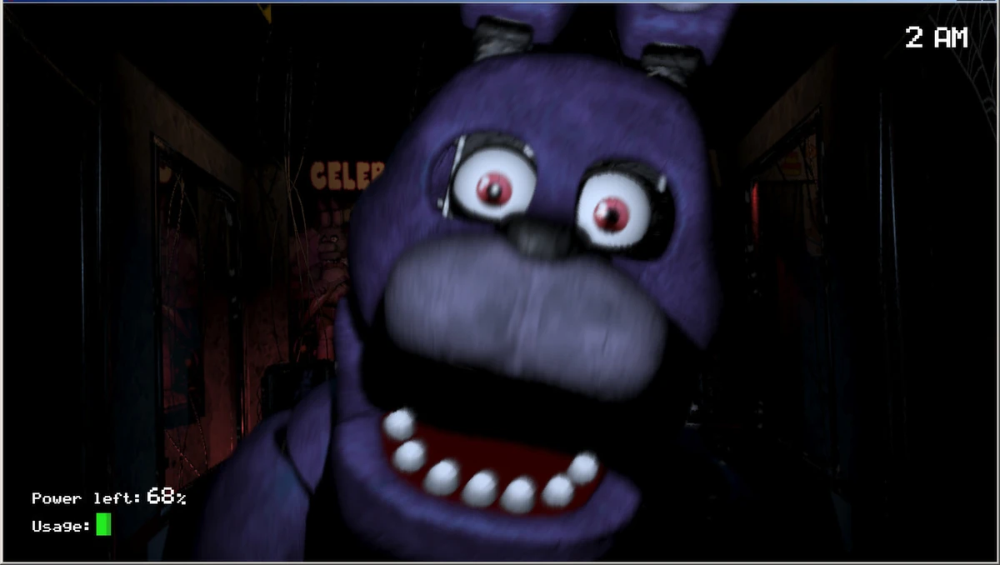

<!DOCTYPE html>
<html lang="id">
<head>
  <meta charset="UTF-8">
  <meta name="viewport" content="width=device-width, initial-scale=1.0">
  <title>Pesan Khusus</title>
  
</head>
<body>
  <!-- Welcome Screen -->
  

    <h1>Pesan Khusus</h1>
    
Dari: Faishal Amir Khallis

    
Untuk: Kalian Semua

    
Klik layar untuk memuat pesan...

  

  <!-- Jumpscare Screen -->
  

    <h1>DARI FAISHAL AMIR KHALLIS!</h1>
    <!-- Ganti gambar hantu sesuai file Anda -->
    
    
UNTUK KALIAN SEMUA!

    <button class="close-btn" onclick="closeScare()">Tutup</button>
  

  <!-- Audio -->
  <audio id="audio" preload="auto">
    <source src="scream.mp3" type="audio/mpeg">
  </audio>

  
</body>
</html>
